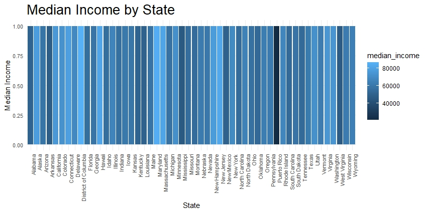

Assignment 2

For this assignment, I had the opportunity to expand my skills in working with Tidyverse packages. Through this experience, I was able to export two plots using various packages within the Tidyverse suite. Additionally, I was able to explore a new dataset and use the Tidyverse packages to transform and manipulate the data to create a third dataset that was of personal interest to me. Overall, this assignment provided a valuable learning experience and allowed me to gain practical knowledge in using Tidyverse packages for data analysis and visualization.

<a href="plot1.jpeg">Plot one</a>

<a href="plot2.jpeg">Plot two </a>
